# Analysis and Design Document

# Requirement analysis

## Assignment Specification
Design and implement an application for the front desk employees of a bank. 
The application should have two types of users (a regular user represented by the front desk employee and an administrator user)
which have to provide a username and a password in order to use the application.

## Functional requirements 
This application has different functional requirements for different users.

A **regular user(employee)** can perform the following operations:
   * Add/update/view client information (name, identity card number, personal numerical code, address, etc.).
   * Create/update/delete/view client account (account information: identification number, type, amount of money, date of creation).
   * Transfer money between accounts.
   * Process utilities bills. (Pay bills of clients from their spending accounts).

The **administrator user** can perform the following operations:
   * CRUD on employees’ information.
   * Generate reports for a particular period containing the activities performed by an employee.  

## Non-functional Requirements

**Maintainability** : Mean time to repair should be less than 24 hours.

**Performance** : The system should perform the operations fast for not making the client to wait too much.This should not take longer than 2 seconds.

**Response Time** : The program should be able to receive new UI operations in 0.1 second after the user made an interaction with the program in 90% of the time. In the remaining 10% the program should react in 1 second. 

**Portability** : The system must be able to run on all major operating system : Windows, Linux, etc.

**Availability**: The system must be available 99.9% of the time when the application is running and used by the users. 

**Extensibility** : The system must be capable to add new features such as creating an hierarchy of roles for the employees to assure that they can have the rights access for the operations that only they can do.

# Use-Case Model
This use case show us what are the main operations that the employee can perform using the bank application.

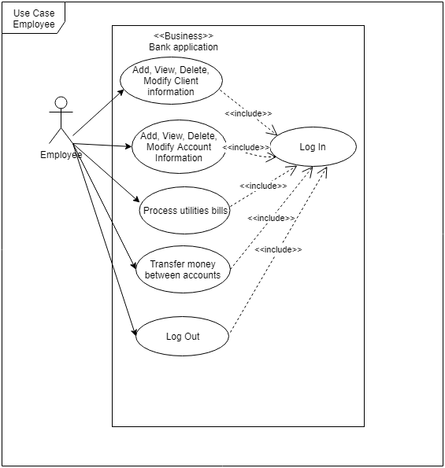

This use case show us what are the main operations that the admin can perform using the bank application.

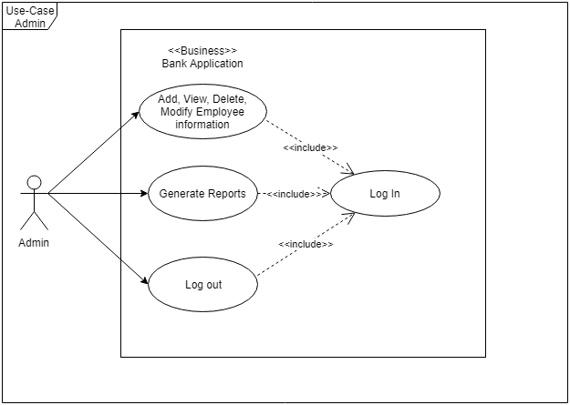

## Use case 1

    * Use case: generate reports
    * Level: one of: user-goal level
    * Primary actor: admin user
    * Main success scenario: 
                    * the admin completes the login process (prequisite).
                    * the admin selects the generate reports option
                    * the admin introduces the data for the necessary task : name of employee and the dates.
                    * the admin will receive a report (a txt file) with the required activities performed by an employee.
    * Extensions: the report can be empty because the employee doesn't exist or doesn't performed any actions between the input dates.

## Use case 2

    * Use case: transfer money between accounts
    * Level: user-goal level
    * Primary actor: employee(regular) user
    * Main success scenario: 
                    * the employee completes the login process (prequisite).
                    * the employee selects the bank operations option.
                    * the employee introduces the data for the necessary task: the ids of two accounts and the id of the client.
                    * the admin will receive a message if the operation succeded.
    * Extensions: in case the client doesn't have enough money to transfer from an account to another a failure message will be shown.

## Use case 3

    * Use case: use case goal
    * Level: one of: summary level, user-goal level, sub-function
    * Primary actor: a role name for the actor who initiates the use case
    * Main success scenario: the steps of the main success scenario from trigger to goal delivery
    * Extensions: alternate scenarios of success or failure>

# System Architectural Design

## Architectural Pattern Description

The layers architectural pattern is used in this project.

Components within the layered architecture pattern are organized into horizontal layers, each layer performing a specific role \
within the application (presentation layer, business layer and data access layer).

The layered architectural style can be described as an inverted pyramid of reuse where each layer aggregates the responsibilities and abstractions of the layer directly beneath it. With strict layering, components in one layer can interact only with components in the same layer or with components from the layer directly below it.

Using layered architectural style you can achieve better:
   * abstraction
   * encapsulation
   * clearly defined functional layers
   * high cohesion
   * reusability
   * loose coupling

## Diagrams

The purpose of the layers architecture is to create a logical separation of the components. A three-layer architecture was chosen to keep the system modular and loosely coupled.

Each layer performs the following tasks:
   * **Presentation layer** : interacts with the user, showing the GUI and handles user events.
   * **Business layer** : here it is created the logic of the application which can be used by other components.
   * **Data layer** : responsible for fetching data from various data sources, primarily from the database.
   
Also we can have also a layer or package which includes the models and the validators for these models.

### Package Diagram

In the package diagram it is presented better the separation of the components(layers) and what others packages are included into them.

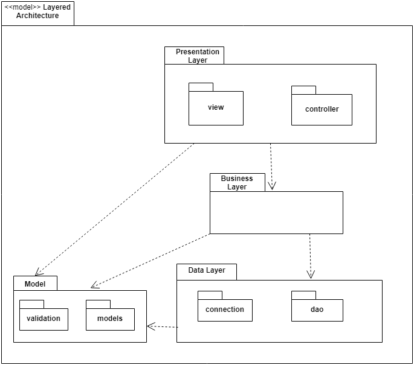

### Component Diagram

In the component diagram we can notice what kind of services each layer performed by showing the main components which are included in the layers.

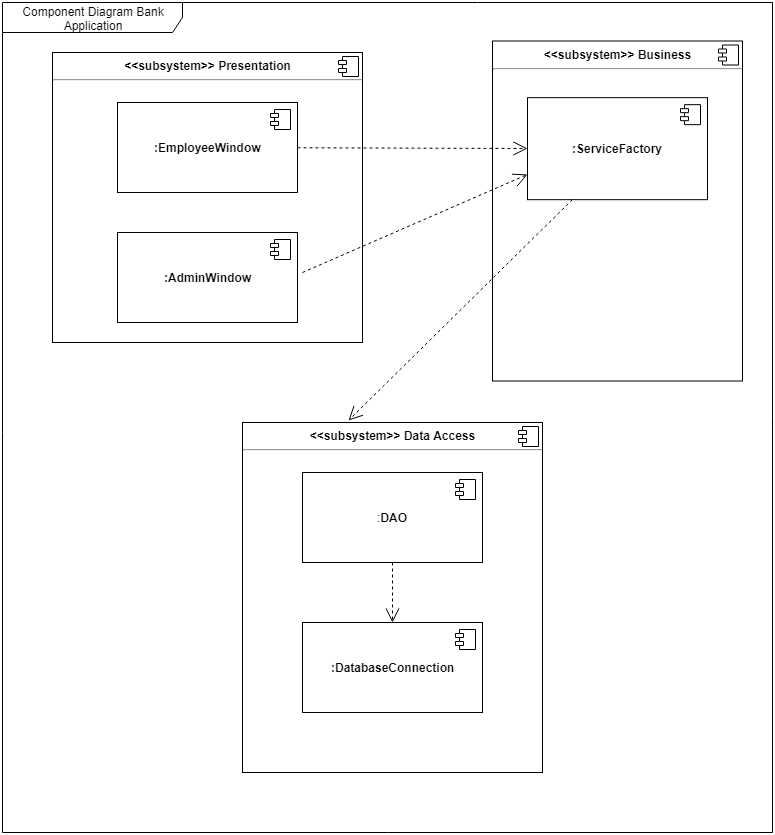

### Deployment Diagram

In the deployment diagram it is shown how the bank application system is connected to the database. This is done by using JDBC.

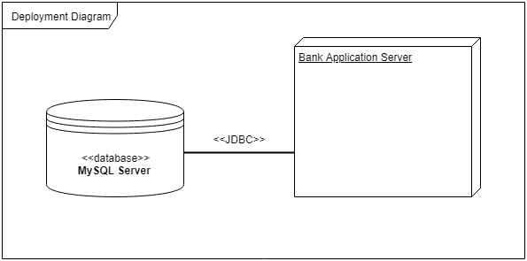

# UML Sequence Diagrams

This sequence diagram show us the insert query of an Employee object performed by the admin.

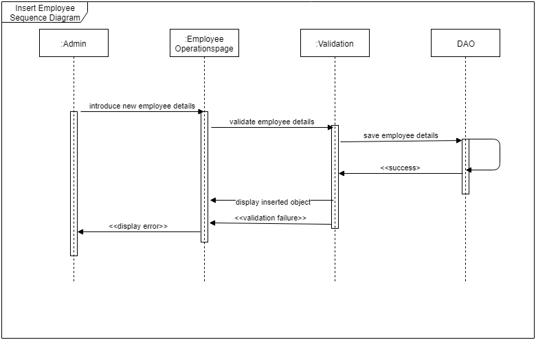

# Class Design

## Design Patterns Description
Describe briefly the used design patterns.

## UML Class Diagram
Create the UML Class Diagram and highlight and motivate how the design patterns are used.

The UML Class Diagram was generated by using IntelliJ IDEA for the purpose to see better the relationships between classes from different layers.

This is presented the main diagram which contains all the classes from my project.

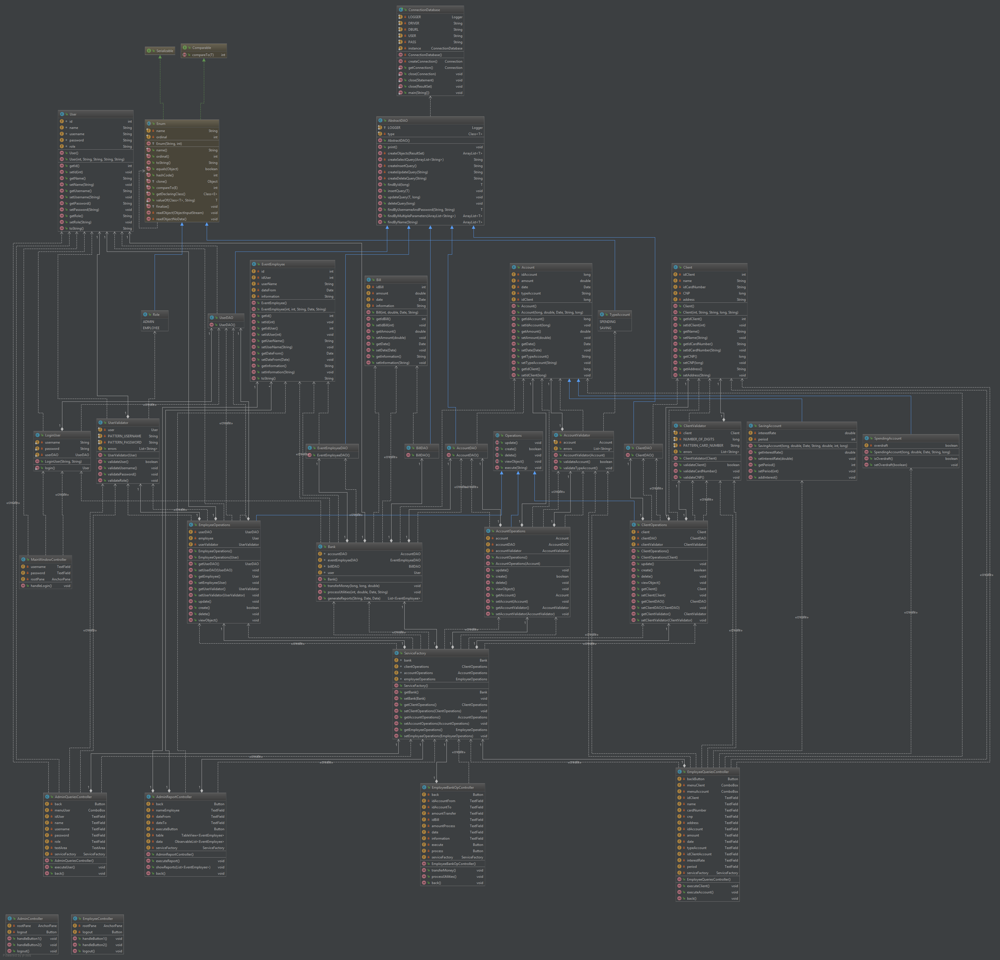

Here are presented others parts of my class diagram.

**The class diagram for business layer.**

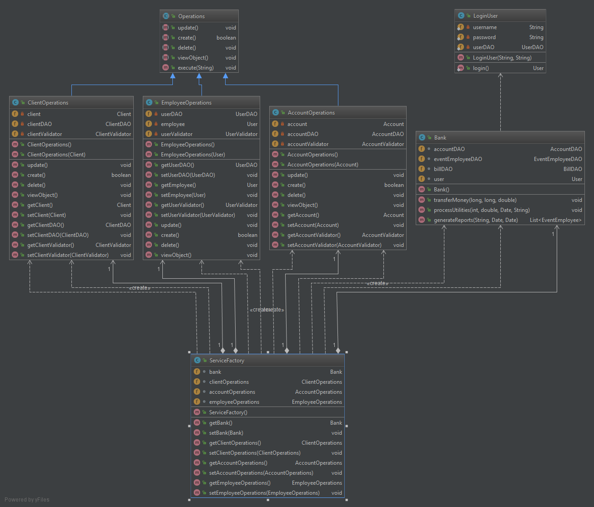

**The class diagram for the relationship between business layer and data access layer.**

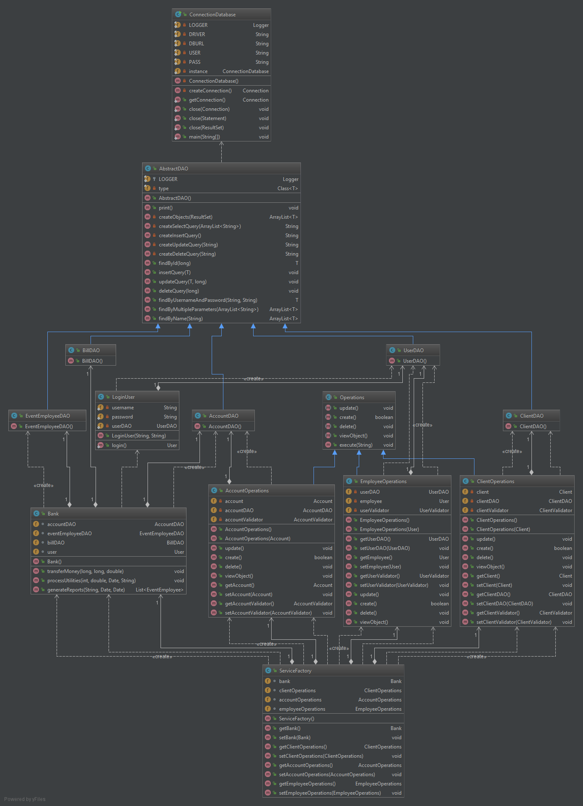

**The class diagram for the relationship between business layer and presentation layer.**

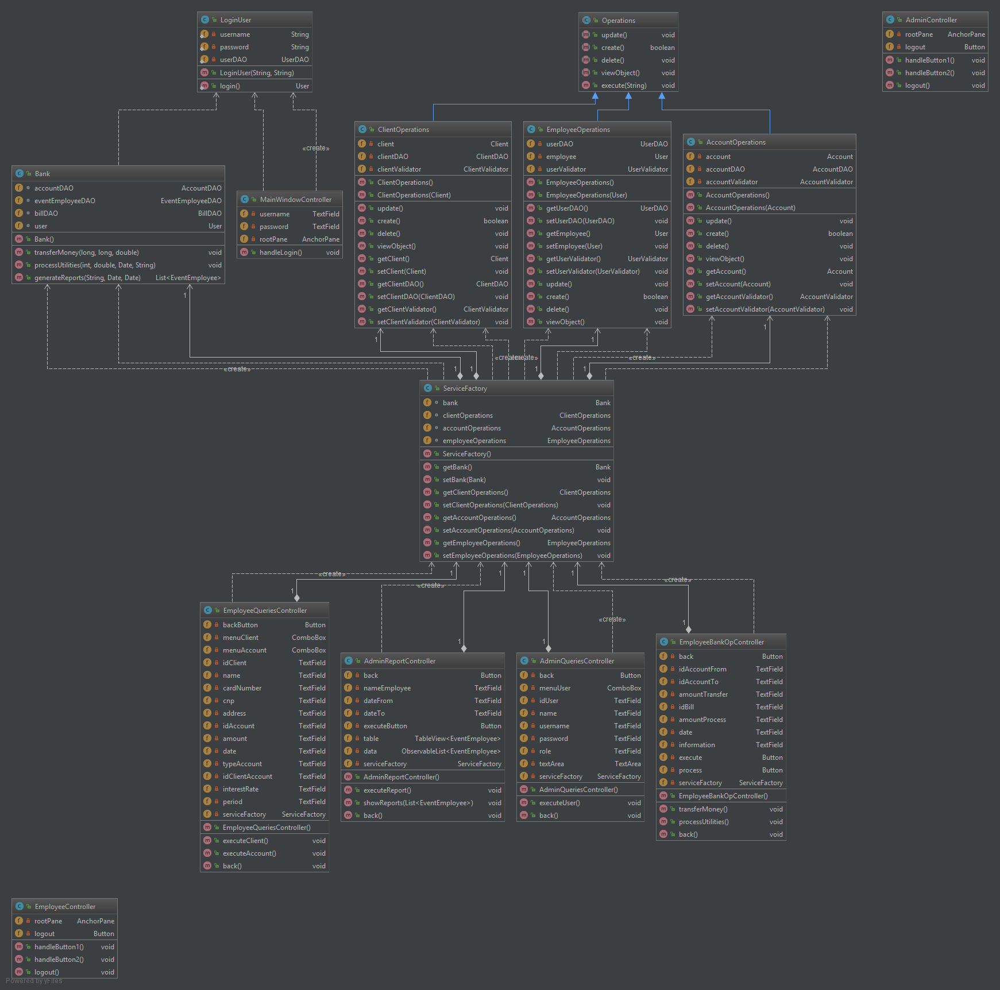

# Data Model
Present the data models used in the system’s implementation.
The data model is presented by using entity relationship model.

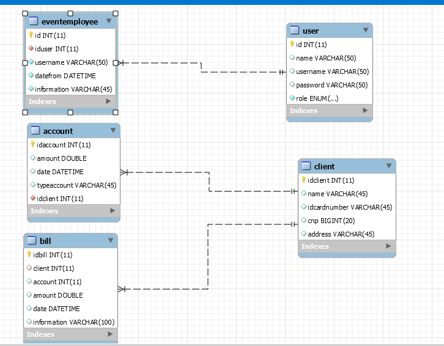

# System Testing
Present the used testing strategies (unit testing, integration testing, validation testing) and testing methods (data-flow, partitioning, boundary analysis, etc.).

It was performed only the system manually testing at every step which was done in the assignment. After a part of the system was built, the system was tested manually.

# Bibliography
*Layered Architecture: https://msdn.microsoft.com/en-us/library/ee658117.aspx

*Diagrams: https://www.uml-diagrams.org/

